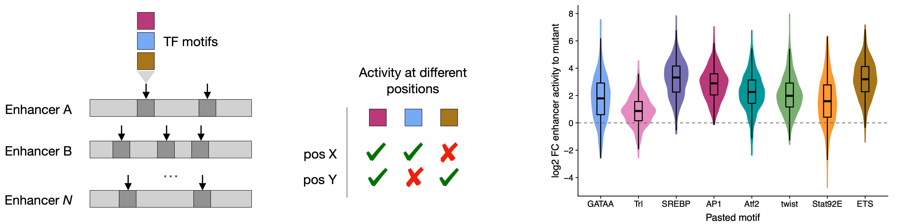

# Drosophila motif pasting STARRseq
Systematic pasting of Drosophila TF motifs in hundreds of enhancer positions  
		- Sequencing reads were processed as in [here](https://github.com/bernardo-de-almeida/DeepSTARR/tree/main/Oligo_UMISTARRseq)  
		- [R markdown to reproduce results](Drosophila_motif_pasting_STARRseq_analysis.Rmd)  
		- [Results in html](https://rawcdn.githack.com/bernardo-de-almeida/Variant_STARRseq/86e8cab20aab4f7d174b20c48c677c7ec99523f5/Drosophila_motif_pasting_STARRseq/Drosophila_motif_pasting_STARRseq_analysis.html)  

	

The raw sequencing data are available from GEO under accession number [GSE211659](https://www.ncbi.nlm.nih.gov/geo/query/acc.cgi?acc=GSE211659).  
The data necessary to reproduce all results and figures are available on zenodo at https://doi.org/10.5281/zenodo.7010528. Please download the respective datasets and follow the scripts above.    

## Questions
If you have any questions/requests/comments please contact me at [bernardo.almeida94@gmail.com](mailto:bernardo.almeida94@gmail.com).
