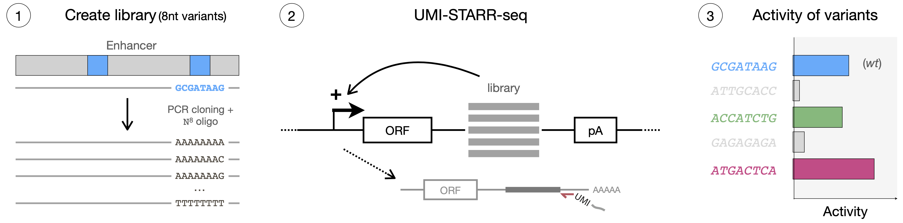
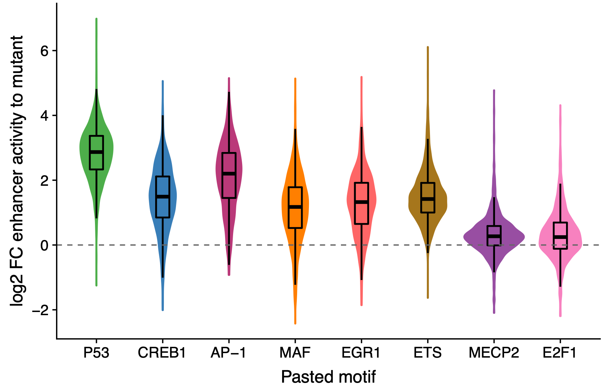

# Variant_starrseq
This repository contains the code used to process all the data and reproduce the results and figures from the manuscript "Enhancers display sequence flexibility constrained by transcription factor motif syntax".

For more information, see the preprint:  
*<ins>Enhancers display sequence flexibility constrained by transcription factor motif syntax</ins>*  
Franziska Reiter\*, Bernardo P. de Almeida\*, Alexander Stark. bioRxiv  

The raw sequencing data are available from GEO under accession number [GSEXXX](https://www.ncbi.nlm.nih.gov/geo/query/acc.cgi?acc=GSEXXX).  
The data necessary to reproduce all results and figures are available on zenodo at https://doi.org/10.5281/zenodo.XXX. Please download the respective datasets and follow the scripts below.    

## [Random_variant_STARRseq](Random_variant_STARRseq)
Random 8nt variants tested at seven enhancer positions in Drosophila S2 cells
	- [Pipeline for mapping sequencing reads](Random_variant_STARRseq/Read_mapping_pipeline.sh)
	- [R markdown to reproduce results](Random_variant_STARRseq/Random_variant_STARRseq_analysis.Rmd)
	- [Results in html](Random_variant_STARRseq/Random_variant_STARRseq_analysis.html)

## [Drosophila_motif_pasting_STARRseq](Drosophila_motif_pasting_STARRseq)
Systematic pasting of Drosophila TF motifs in hundreds of enhancer positions
	- Sequencing reads were processed as in [here](https://github.com/bernardo-de-almeida/DeepSTARR/tree/main/Oligo_UMISTARRseq)
	- [R markdown to reproduce results](Drosophila_motif_pasting_STARRseq/Drosophila_motif_pasting_STARRseq_analysis.Rmd)
	- [Results in html](Drosophila_motif_pasting_STARRseq/Drosophila_motif_pasting_STARRseq_analysis.html)

## [Human_motif_pasting_STARRseq](Human_motif_pasting_STARRseq)
Systematic pasting of human TF motifs in hundreds of enhancer positions
	- Sequencing reads were processed as in [here](https://github.com/bernardo-de-almeida/DeepSTARR/tree/main/Oligo_UMISTARRseq)
	- [R markdown to reproduce results](Human_motif_pasting_STARRseq/Human_motif_pasting_STARRseq_analysis.Rmd)
	- [Results in html](Human_motif_pasting_STARRseq/Human_motif_pasting_STARRseq_analysis.html)

## Questions
If you have any questions/requests/comments please contact me at [bernardo.almeida94@gmail.com](mailto:bernardo.almeida94@gmail.com).
